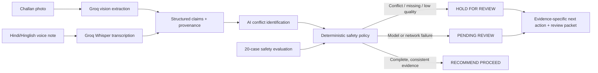

# Sakshi architecture

## Decision boundary

Models can read difficult handwriting, transcribe code-mixed speech, and identify candidate conflicts. They cannot authorize payment. The application enforces the final state: any conflict, unreadable critical field, missing evidence, or low evidence quality routes to review.

## Production path

At higher scale, keep uploads in object storage, process them through a job queue, cache safe repeated work, enforce rate limits and retries, and store immutable review packets in an audit database.
